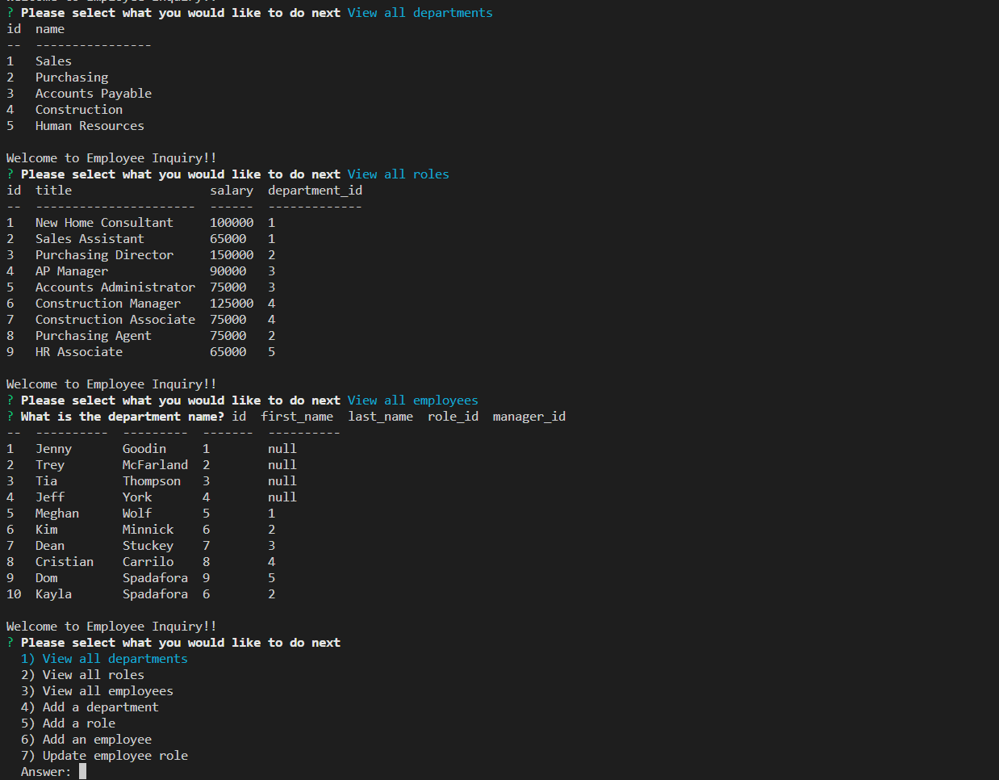

# Employee Inquiry

  

  ## Description
  Employee Inquiry is a back end application for building and maintaining the employee database of a company. This application can be a foundation to start on and will scale with company growth. Employee Inquiry allows anyone in the company to view all employees, roles, and who is their reporting manager.

  ## Table of Contents
  1. [Installation](#installation)
  2. [Usage](#usage)
  3. [License](#license)
  4. [Contributing](#contributing)
  5. [Tests](#tests)
  6. [Questions](#questions)

  ## Installation
  To install the necessary dependencies, run the following command:
  You will need to git clone the repo. Once that is complete, all the dependacies are in the package.json. So you will just need to run npm install in the command terminal.

  ## Usage
  Please node index.js in the command terminal to begin the initial prompt. From there you will be guided through the app by questions. 
  [Video Demonstration](https://drive.google.com/file/d/1nXjVJkudRZRvboI3mvXMvwgKLepi0th9/view)

  
  

  ## License 
  This project is licensed under the MIT license.

  ## Contributing
  nobody

  ## Tests
  To run tests, run the following command:
  no testing at the moment
  
  ## Questions
  If you have any questions about this repo, open an issue or contact me directly at [domspadafora@gmail.com](mailto:domspadafora@gmail.com).
  You can find more of my work at [DomSpadafora](https://www.github.com/DomSpadafora).

